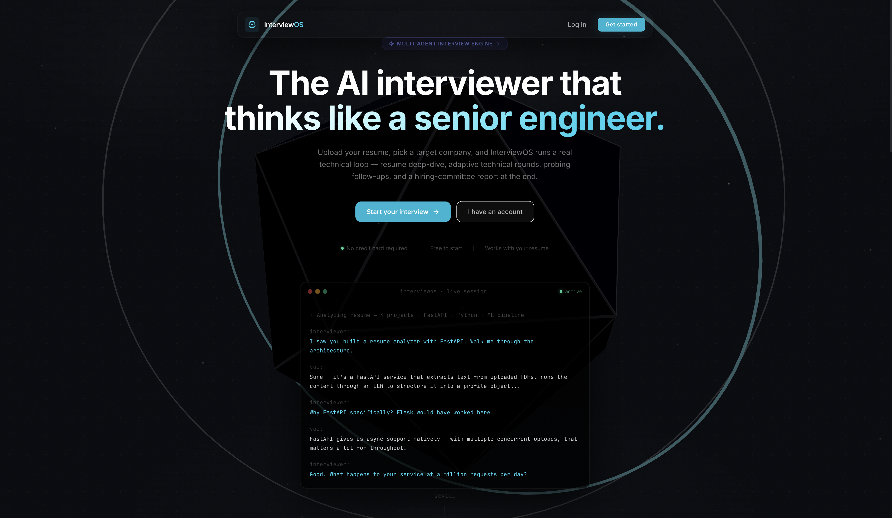
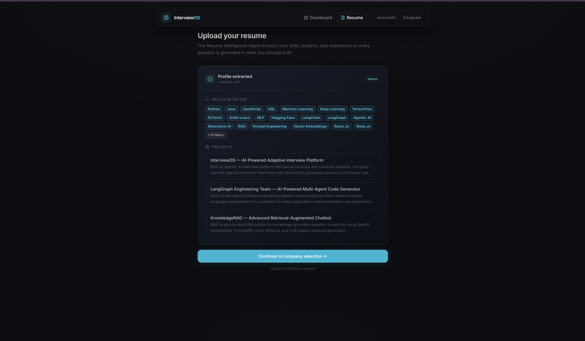
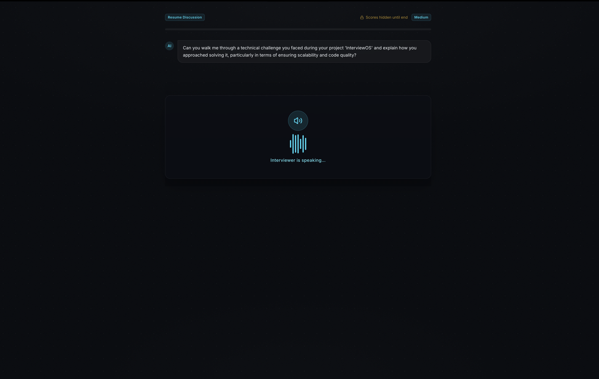
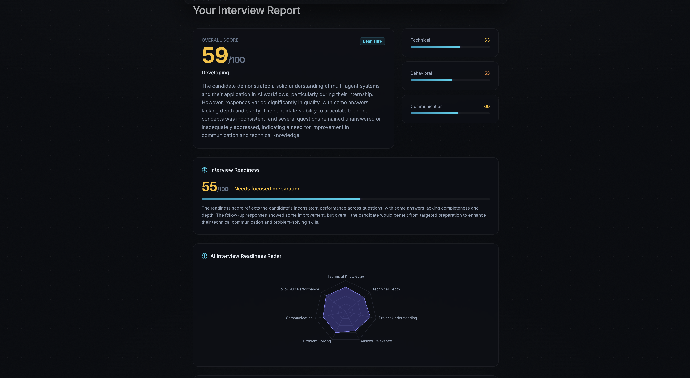

<div align="center">

# ⚡ InterviewOS

### *The AI Interviewer that thinks like a Senior Engineer.*


<br/>



</div>

<br/>

## 🧠 What is this?

**InterviewOS** is not a chatbot with a resume parser bolted on. It's a full **agentic pipeline** — a swarm of specialized AI agents that plan, question, probe, score, and adapt in real time, the way an actual senior engineer runs a technical interview.

Upload a resume, pick a target company and role, and sit down for a live, adaptive technical interview that gets harder as you prove yourself. Walk away with a hiring-committee-grade report.

> No scripted question banks. No static difficulty. Every interview is generated live, from *your* background.

<br/>


]

<br/>

## 🌌 The Agent Swarm

InterviewOS is built as a chain of single-responsibility AI agents, each doing one job well and passing context downstream.

```
Resume PDF
    │
    ▼
Resume Intelligence Agent
    → structures skills / projects / experience
    │
    ▼
Interview Planner Agent
    → builds a stage plan from profile + role
    │
    ▼
Live Interview Loop
    │
    ├─ Question Generator
    │       → generates each question live, grounded in resume + memory
    │       │
    │       ▼
    ├─ Follow-up Agent
    │       → decides whether to dig deeper on an answer
    │       │
    │       ▼
    ├─ Evaluation Agent ⇄ Difficulty Agent
    │       → scores the answer, adapts difficulty live
    │       │
    │       ▼
    └─ Memory Agent
            → tracks strong/weak topics across the session
    │
    ▼
Report Generation Agent
    → synthesizes the transcript into a hiring verdict + growth plan
```

| Agent | Role |
|---|---|
| 🧬 **Resume Intelligence** | Parses raw PDF text into a structured candidate profile |
| 🗺️ **Interview Planner** | Builds a stage-by-stage interview plan for the target company/role |
| ❓ **Question Generator** | Generates each question live, grounded in resume + conversation memory |
| 🔍 **Follow-up Agent** | Decides — like a real interviewer would — whether to dig deeper |
| 📊 **Evaluation Agent** | Scores every answer across 5 dimensions: accuracy, completeness, confidence, communication, depth |
| 📈 **Difficulty Agent** | Adapts difficulty live: easy → medium → hard → senior → staff |
| 🧠 **Memory Agent** | Tracks strong/weak topics across the full session |
| 📄 **Report Generation Agent** | Synthesizes the transcript into a hiring-committee-style verdict |

Every agent is a pure, typed Python function — context in, JSON out — coordinated by a small, explicit state machine (`interview_orchestrator.py`). No hidden magic, no framework lock-in: swapping in a full `langgraph.StateGraph` runtime later is a mechanical change, not a rewrite.

<br/>

## ✨ Features

- 🔐 **JWT Auth** — register, login, session handling
- 📄 **Resume Upload & AI Parsing** — drag-and-drop PDF → structured candidate profile
- 🎯 **Company & Role-Targeted Interviews** — questions grounded in the specific role you're prepping for
- 💬 **Live Adaptive Interview Loop** — chat-style transcript, real-time scoring, live difficulty badge, stage progress
- 🧾 **AI-Generated Hiring Report** — radar chart, strengths/weaknesses, recommendation, and a personalized learning plan
- 📊 **Dashboard** — interview history, average scores, quick stats

<br/>



<!-- Swap this for a Report screen (radar chart) screenshot once you have one -->


<br/>

## 🛠️ Tech Stack

<div align="center">

| Layer | Stack |
|---|---|
| **Backend** | FastAPI · PostgreSQL · SQLAlchemy · Alembic · JWT |
| **Frontend** | React 19 · TypeScript · Vite · TailwindCSS |
| **State/Data** | Zustand · TanStack Query · Axios · React Hook Form |
| **Motion/UI** | Framer Motion |
| **AI Layer** | Provider-agnostic LLM client (OpenAI wired) |
| **Infra** | Docker Compose · Redis (queue-ready) |

</div>

<br/>

## 🎨 Design Language

Dark theme by default. **Inter** for body text, **Space Grotesk** for headings, **JetBrains Mono** for anything transcript- or code-flavored. A single violet accent — `#6c63f7` — runs through the whole product.

The centerpiece is the live interview transcript itself: styled like a terminal/chat hybrid, with question bubbles on the left, your answers on the right, and an inline score readout after every turn — so you *see* the agent thinking instead of talking to a black box.

<br/>

## 🚀 Getting Started

### 1. Configure environment

```bash
cp backend/.env.example backend/.env
# edit backend/.env and set OPENAI_API_KEY
```

### 2. Launch with Docker

```bash
docker compose up --build
```

| Service | URL |
|---|---|
| 🔌 API | `http://localhost:8000` (Swagger at `/docs`) |
| 🖥️ Web | `http://localhost:5173` |

### Running without Docker

```bash
# Backend
cd backend
python -m venv venv && source venv/bin/activate
pip install -r requirements.txt
# point DATABASE_URL in .env at a local Postgres instance
uvicorn app.main:app --reload

# Frontend
cd frontend
cp .env.example .env
npm install
npm run dev
```

<br/>

## 📁 Project Structure

```
interviewos/
├── backend/
│   ├── app/
│   │   ├── main.py                 # FastAPI app, CORS, router mounting
│   │   ├── core/                   # config, database, security (JWT/hashing)
│   │   ├── models/                 # SQLAlchemy: user, resume, interview, report
│   │   ├── schemas/                # Pydantic request/response DTOs
│   │   ├── api/routes/             # auth, resumes, interviews, reports, dashboard
│   │   └── services/
│   │       ├── llm_client.py               # provider-agnostic LLM interface
│   │       ├── resume_parser.py            # PDF -> raw text
│   │       ├── interview_orchestrator.py   # state machine coordinating agents
│   │       └── agents/                     # one file per agent
│   ├── alembic/                    # migration scaffolding
│   ├── requirements.txt
│   └── Dockerfile
├── frontend/
│   ├── src/
│   │   ├── pages/                  # Landing, Login, Register, Dashboard,
│   │   │                           # ResumeUpload, StartInterview, Interview, Report
│   │   ├── components/ui/          # Button, Card, Input, Badge, ProgressBar
│   │   ├── components/layout/      # Navbar, ProtectedRoute
│   │   ├── api/                    # Axios client + typed endpoint functions
│   │   ├── store/                  # Zustand auth store
│   │   └── types/                  # shared TS types matching backend schemas
│   └── Dockerfile
├── docker-compose.yml
└── README.md
```

<br/>

## 🧭 Roadmap — What's Scaffolded, Not Yet Wired

InterviewOS is built so these plug in without a restructure:

- [ ] 🌐 **Company Research Agent** — live web-search grounding for company-specific questions
- [ ] 💻 **Coding Interview Agent + Monaco Editor** — sandboxed code execution for the DSA round (Judge0 / Firecracker / Piston)
- [ ] ⚙️ **Celery Async Pipelines** — move resume parsing & report generation off the request thread (Redis already running)
- [ ] 📤 **PDF Report Export** — downloadable hiring report (WeasyPrint)
- [ ] 🗃️ **Alembic Migrations** — proper schema versioning (currently `create_all()` on startup)
- [ ] 🧪 **Test Suite + CI**
- [ ] 🎙️ **Live Voice Interaction**

<br/>

## 🤝 Contributing

Contributions are welcome. Open an issue to discuss significant changes before submitting a PR, and keep new code consistent with the existing agent pattern (pure function, typed input/output, no hidden state).

## 📄 License

MIT — see [LICENSE](./LICENSE) for details.

<br/>

<div align="center">

### 🛰️ Built like real infrastructure, not a demo.

*Every agent is pure. Every stage is explicit. Every interview is real.*

<br/>

⭐ **Star this repo if you're building the future of interview prep.**

</div>
